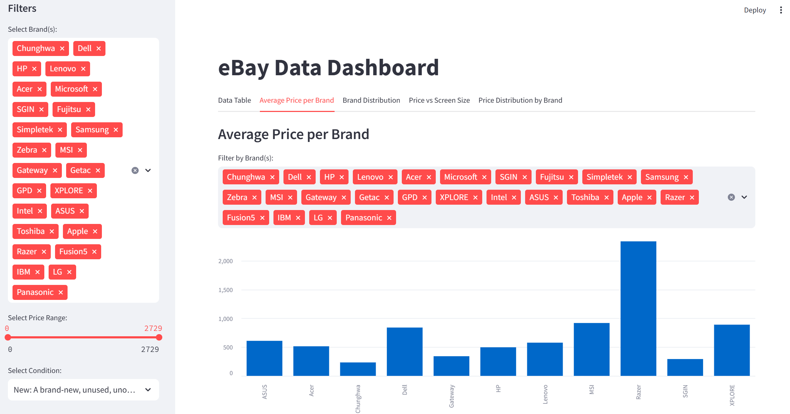

# 📊 eBay Laptop Sales Dashboard

## **Project Overview**
This project showcases an interactive data dashboard built using Streamlit and Plotly to analyze eBay laptop sales. The dashboard allows users to explore key data points, visualize trends, and gain actionable business insights from the cleaned eBay dataset.

The primary goal was to enable dynamic filtering, insightful visualizations, and user-friendly interaction with the dataset, helping stakeholders make data-driven decisions.

---

## **Key Features**
- **Data Wrangling & Cleaning:** Pre-processed raw eBay laptop sales data for accuracy and usability.
- **Dynamic Filtering:** Multiple input widgets for users to filter and explore specific data points.
- **Interactive Visualizations:** 
  - Streamlit charts for quick data overviews.
  - Plotly Express charts with dynamic filtering capabilities.
- **Business Insights:** Accompanying analysis for each chart to provide actionable recommendations.
- **Enhanced User Experience:** Clear titles, labels, and professional design for a seamless user journey.

---

## **Visualizations Included**
- **Sales Distribution by Brand** *(Streamlit Chart)*
- **Price Trends Over Time** *(Plotly Express Line Chart)*
- **Top Sellers by Category** *(Dynamic Plotly Bar Chart with Filter Options)*

---



---

## **Business Impact**
The dashboard offers valuable insights into pricing strategies, popular brands, and sales trends, empowering eBay sellers and analysts to optimize listings and maximize sales.

---

## **Getting Started**
1. **Clone the repository:**
   ```bash
   git clone https://github.com/TinaGrkovic/ebay_dashboard.git
   cd ebay_dashboard
2. **Run the final notebook:**
   ```bash
   streamlit run dashboard.py

### **Repository Structure**
  ```bash
## 📁 **Project Structure**
  ebay_dashboard/
  ├──dashboard.py                  # Streamlit App code for the dashboard
  ├──dashboard_preview.png         # Screenshot of the dashboard UI
  ├──EbayCleanedDataSample.csv     # Cleaned dataset used for dashboard analysis
  └──README.md
  
  
